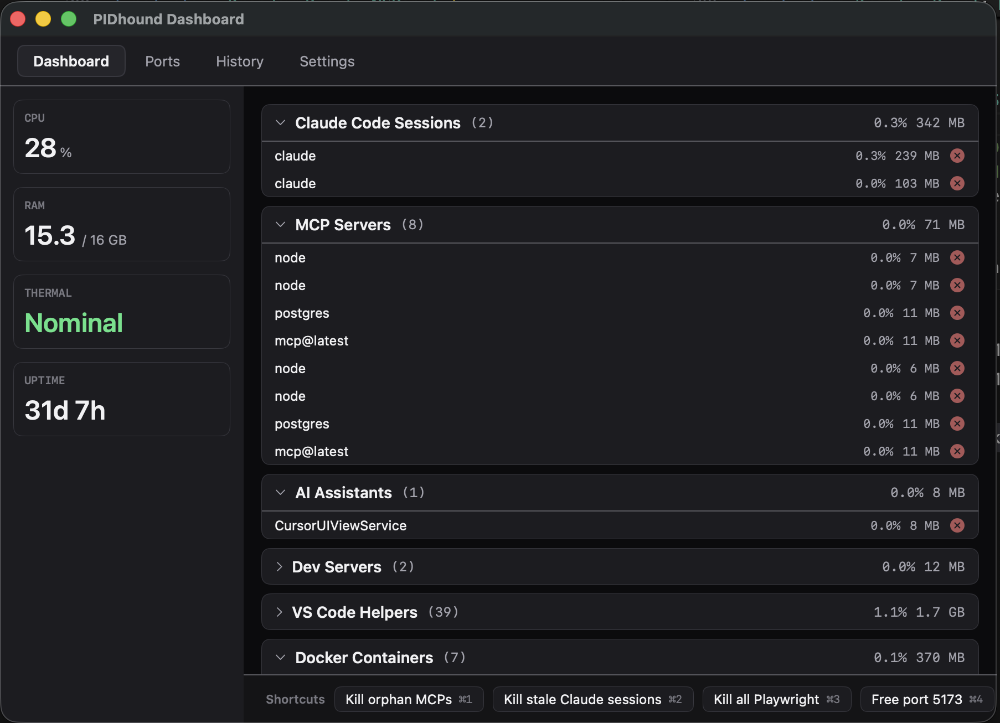
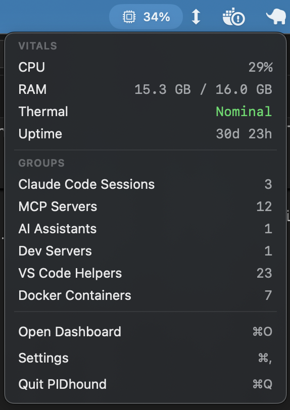

# PIDhound

> Sniffs out the AI processes you forgot about.

A Mac menu-bar tool for finding and killing stale Claude sessions, MCP servers, Playwright runs, dev servers, and Docker containers — before your fans spin up.



Heavy AI coding sessions kept ending the same way: multiple Claude windows running, MCPs everywhere, Playwright in the background, Docker chugging — and at some point my MacBook fans would scream and the case got hot. I'd ask Claude what to kill, paste the commands back one at a time, things would calm down. Next session, same dance. After enough of that I built a button.

## Install

Download the latest DMG from [Releases](https://github.com/zigax1/PIDhound/releases), drag PIDhound to Applications, and launch.

**Requirements:** macOS 14 Sonoma or later, Apple Silicon (M1 / M2 / M3 / M4).

> **First launch:** the v1.0 DMG is ad-hoc signed but not notarized. On macOS Sonoma, Sequoia, and Tahoe (26), Gatekeeper blocks ad-hoc signed apps on first launch. To clear the block, run this once in Terminal:
>
> ```sh
> xattr -dr com.apple.quarantine /Applications/PIDhound.app
> ```
>
> Then double-click PIDhound as usual. You only need to run this once per install.
>
> The **System Settings → Privacy & Security → Open Anyway** flow can also work on some systems, but it's unreliable for ad-hoc signed apps — if you tried it and the app still won't open (or shows "damaged"), run the command above.

A Homebrew cask is planned for v1.1.

## Why

Modern AI-assisted coding spawns dozens of long-lived processes per workday — Claude sessions, MCP servers (per client, per tool), Playwright runs, dev servers, AI helpers. Many outlive their usefulness. The result: sustained high CPU, hot Mac, loud fans, drained battery.

PIDhound is built for the panic moment: glance at the menu bar, see four stale items eating 1.2 GB, hit one button, fans calm down.

It is **not** an Activity Monitor replacement. It is opinionated, narrow, and focused on AI/dev workflow hygiene.

## Quick tour

### Simple Mode (default)



- Always-visible menu bar widget with CPU % and a stale-process counter
- Vitals sidebar: CPU, RAM, thermal pressure, uptime
- Semantic process groups: Claude sessions, MCP servers, AI assistants, Playwright, test runners, dev servers, Docker containers
- One-click batch kills for stale / orphan / zombie items
- Listening Ports tab with kill-by-port
- Minimal history view: 24 h sparkline + kill event log
- Four themes: Modern (default), Terminal Green, Cyberdeck Amber, Neon Cyber

<br clear="all">

### Power User Mode (toggle in Settings — coming in v2.0)

- AI on-demand chat: "What was running when CPU spiked at 14:30?"
- Daily summary digest
- Full thermals via `powermetrics`: fan RPM, per-core temps, per-process energy
- Multi-day analytics charts
- AI provider: OpenRouter (default) or Anthropic direct

## How it differs from Activity Monitor

PIDhound isn't trying to replace Activity Monitor. It's a different shape:

| Concern | Activity Monitor | PIDhound |
|---|---|---|
| Process grouping | None — every `node` is its own row | Semantic groups: Claude sessions, MCPs, Playwright, etc. |
| Stale / orphan detection | None | Tags processes idle > 2h, orphan, or zombie |
| Batch kills | One process at a time | One-click cleanup of all stale items |
| Listening ports | Not shown | Dedicated tab with kill-by-port |
| Docker containers | Shows only the wrapper | Shows individual containers via `docker ps` |
| History | Live only | 24 h timeline of vitals + kill events |
| Menu bar widget | None | Always-visible mini status with temp + stale count |
| Custom kill profiles | None | Saved shortcuts with keybinds |

Use Activity Monitor when you want the system-wide picture. Use PIDhound when you want to clean up the AI/dev mess.

## How it works

- **Process listing** via `libproc` (native macOS C API) — fast and native, no subprocess overhead.
- **Classification** via a YAML rules file (`Rules.bundle/rules.yaml`) — anyone can add a category by editing the file and submitting a PR.
- **Sensors** via direct IOReport bindings (default, no sudo) — same approach as `macmon` and `asitop`. Power User Mode shells to `powermetrics` for fan RPM and full thermals.
- **Storage** in SQLite (via GRDB.swift) at `~/Library/Application Support/PIDhound/`. Approx 50 MB max.
- **Privacy:** zero telemetry, zero analytics, zero phone-home. Everything stays on your Mac.

## Build from source

Requirements: macOS 14+ Sonoma, Apple Silicon, Command Line Tools (full Xcode not required).

```sh
git clone https://github.com/zigax1/PIDhound.git
cd PIDhound
make build
```

To actually run the menu bar app, use the `.app` bundle — `swift run pidhound` is unreliable for status-bar UIs because it bypasses `Info.plist` (`LSUIElement`):

```sh
./scripts/generate-icon.sh
./scripts/build-app-bundle.sh
open dist/PIDhound.app
```

For headless debugging, `swift run pidhound-cli` works fine — it has no UI.

To produce a distributable DMG:

```sh
./scripts/build-dmg.sh
open dist/PIDhound-1.0.0.dmg
```

See [CONTRIBUTING.md](./CONTRIBUTING.md) for architecture, classification rule guidelines, and the manual smoke test checklist.

## Contributing

See [CONTRIBUTING.md](./CONTRIBUTING.md) for setup instructions, architecture overview, classification rule guidelines, and the manual smoke test checklist.

Quick links:
- [CLAUDE.md](./CLAUDE.md) — project rules (applies to humans and AI assistants)
- [ROADMAP.md](./ROADMAP.md) — what's planned and what's out of scope

## License

MIT — see [LICENSE](./LICENSE).

## Acknowledgments

- [Stats.app](https://github.com/exelban/stats) — architectural precedent for native macOS menu-bar monitoring
- [macmon](https://github.com/vladkens/macmon) — sensor access patterns on Apple Silicon
- [GRDB.swift](https://github.com/groue/GRDB.swift) — SQLite for Swift
